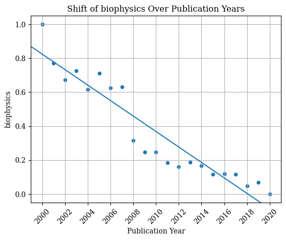
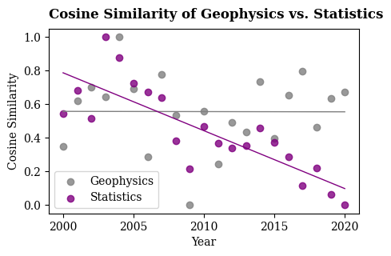

# GloVe Word Embeddings: Investigating Language Use in STEM Academic Papers

Utilized GloVe word embeddings to quantitatively assess keyword similarities in academic papers across two decades. All analysis in `analysis.ipynb`. Both Euclidean distance and cosine similarity are used to compare the similarity between word vectors of key tokens in GloVe. Euclidean distance is sensitive to the magnitude of the vectors, while cosine similarity, on the other hand, solely depends on the direction of the vectors. The average Euclidean distance/cosine similarity were fit into Ordinary Least Squares (OLS) models with publication years to examine the longitudinal change of term use.

For example:

The plot above shows a decrease of cosine similarity between top 25% stemmed tokens of publications in each year, indicates that the semantic similarity between the corresponding words decreases over the years.

The plot above shows the contrast between the outlier Geophysics and a representative of other disciplines—Statistics.
